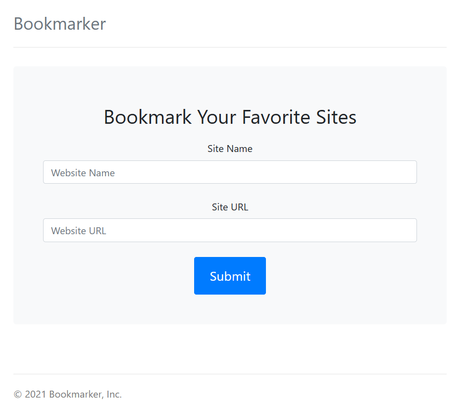
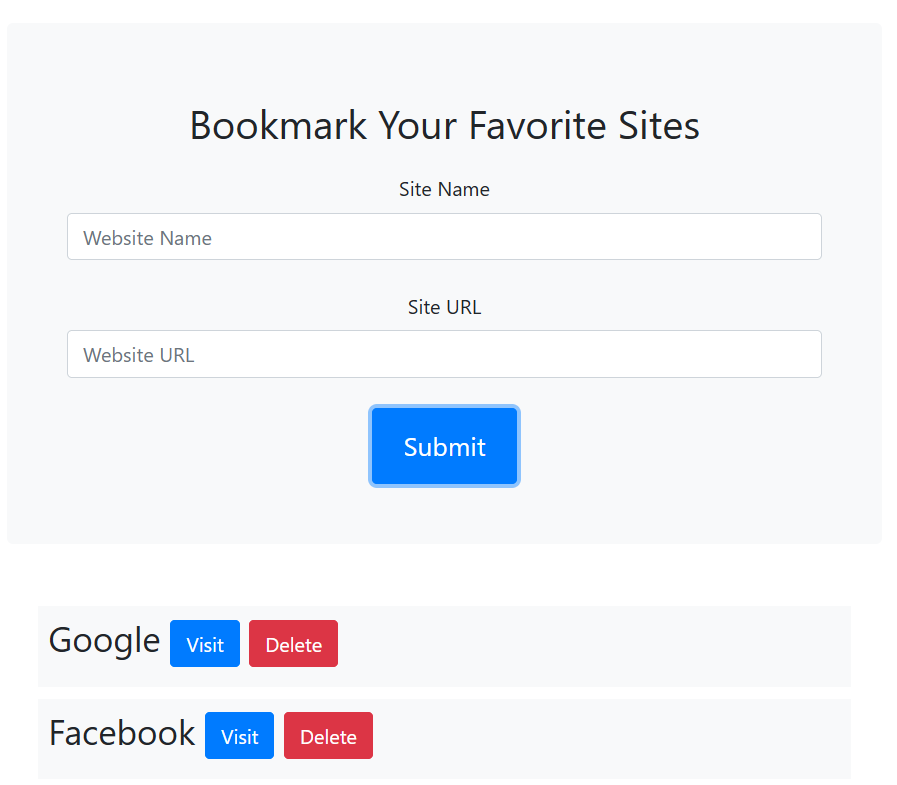

# JS-Bookmarker-App

JavaScript Bookmarker App

<!-- Live link to deployed app -->

Repository: https://github.com/Mdudzik92/JS-Bookmarker-App 
Deployed app: https://mdudzik92.github.io/JS-Bookmarker-App/

<!-- Technologies used -->

JavaScript, Local Storage, HTML, CSS, Bootstrap

<!-- Explanation of what the app is -->

This is a website bookmarking app created with vanilla JavaScript. It utilizes Local Storage to save the user's bookmarks to the browser to persist when they return to the page or refresh. It also includes a bit of Bootstrap CSS for the layout and includes alerts in case the user does not fill out the form properly.

<!-- Screenshots -->

<!-- License -->

MIT

<!-- Contact information -->

Email: mdudzik92@gmail.com
